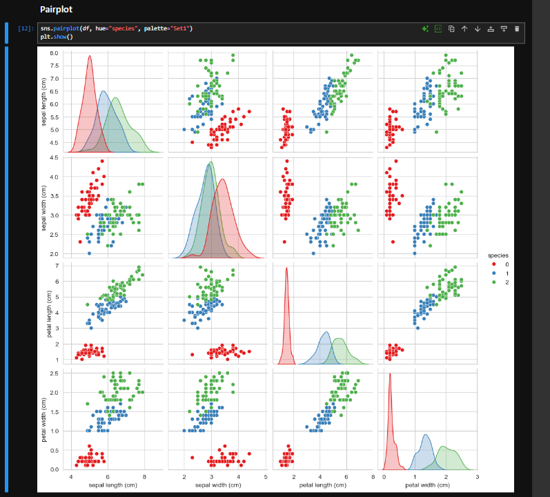
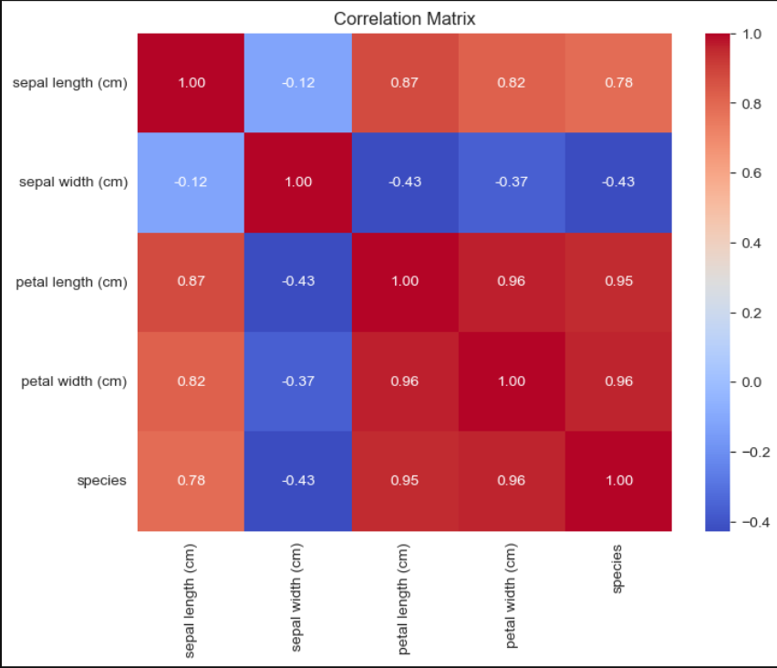
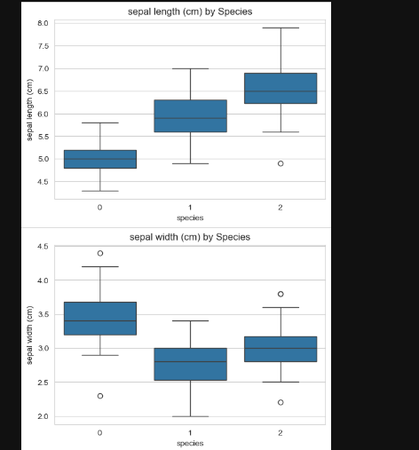
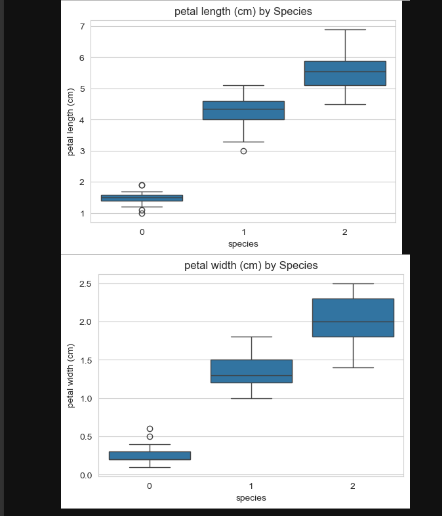
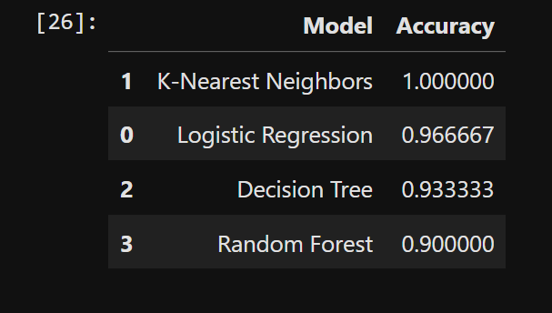

#  Iris Flower Classification

##  Project Overview

This project builds a Machine Learning classification model to identify the species of an Iris flower using its physical measurements.

The project follows a complete Machine Learning workflow including:

- Data Loading
- Exploratory Data Analysis (EDA)
- Data Visualization
- Feature Selection
- Model Training
- Model Evaluation
- Model Comparison

---

##  Dataset

- **Dataset:** Iris Dataset
- **Source:** `sklearn.datasets.load_iris()`
- **Samples:** 150
- **Features:** 4
- **Classes:** 3

Species:

- Setosa
- Versicolor
- Virginica

---

##  Technologies Used

- Python
- Pandas
- NumPy
- Matplotlib
- Seaborn
- Scikit-learn
- Jupyter Notebook

---

##  Exploratory Data Analysis

Performed:

- Dataset Shape
- Data Types
- Missing Value Check
- Descriptive Statistics
- Species Distribution

---

##  Data Visualization

- Pairplot
- Boxplots
- Correlation Heatmap

---

##  Machine Learning Models

- Logistic Regression
- K-Nearest Neighbors (KNN)
- Decision Tree
- Random Forest

---

##  Evaluation Metrics

- Accuracy
- Confusion Matrix
- Precision
- Recall
- F1-Score

---

## Results

Among all the trained models, **K-Nearest Neighbors (KNN)** achieved the highest accuracy of **100%** on the test dataset.

The model also produced excellent Precision, Recall, and F1-Score, making it the best-performing classifier for this project.

---

## 📸 Output Screenshots

### Pairplot



---

### Correlation Heatmap



---

### Boxplots

#### Sepal Features



#### Petal Features



---

### Model Comparison



---

---

##  Project Structure

```text
DataScience-Task1-IrisFlowerClassification
│
├── Iris_Classification.ipynb
├── README.md
├── requirements.txt
└── images
    ├── pairplot.png
    ├── boxplots.png
    ├── heatmap.png
    └── comparison.png
```

---

---

##  Author

**Biswajit Senapati**

Oasis Infobyte Summer Internship Program
